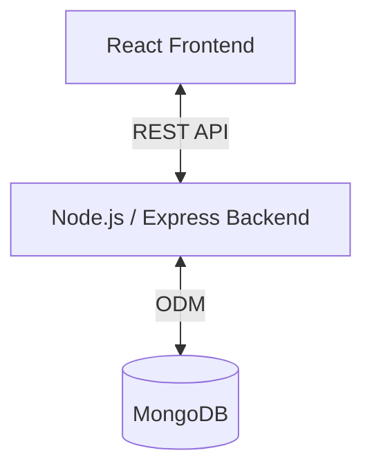

# System Architecture

## Overview
The **Subscription Manager** is a full-stack web application designed to help users track and manage their subscriptions. It features a modern, responsive frontend built with React and a robust backend API built with Node.js/Express and MongoDB.

## High-Level Architecture

The system follows a standard **Client-Server Architecture**:

### Components

1.  **Frontend (Client)**
    *   **Framework**: React 19
    *   **Styling**: Tailwind CSS + Radix UI
    *   **State Management**: React Context / Hooks
    *   **Communication**: Axios (HTTP Requests)
    *   **Responsibility**: UI rendering, user interaction, form validation, state management.

2.  **Backend (Server)**
    *   **Framework**: Express.js (Node.js)
    *   **Runtime**: Node.js v18+
    *   **Responsibility**: API endpoints, authentication, business logic, data validation, database interaction.

3.  **Database**
    *   **System**: MongoDB
    *   **Driver**: Mongoose (ODM)
    *   **Responsibility**: Persistent storage of users, subscriptions, and related data.

## Technology Stack

### Frontend
| Category | Technology | Purpose |
| :--- | :--- | :--- |
| **Core** | React 19 | UI Library |
| **Routing** | React Router v7 | Client-side routing |
| **Styling** | Tailwind CSS | Utility-first CSS framework |
| **UI Components** | Radix UI | Accessible headless UI primitives |
| **Icons** | Lucide React | Iconography |
| **Form Handling** | React Hook Form + Zod | Form state and validation |
| **HTTP Client** | Axios | API requests |
| **Build Tool** | CRA / Craco | Application bundling and configuration |

### Backend
| Category | Technology | Purpose |
| :--- | :--- | :--- |
| **Framework** | Express.js | Standard web framework for Node.js |
| **Runtime** | Node.js | JavaScript runtime |
| **Database** | MongoDB | NoSQL Database |
| **ODM** | Mongoose | Object Data Modeling for MongoDB |
| **Authentication** | JsonWebToken / Bcryptjs | JWT generation and password hashing |
| **Security** | Helmet / CORS | Security headers and cross-origin controls |
| **Environment** | Dotenv | Environment variable management |
| **Logging** | Morgan | HTTP request logger |

## Data Flow

1.  **User Interaction**: User interacts with the UI (e.g., "Add Subscription").
2.  **Request**: Frontend sends an HTTP POST request to the Backend (e.g., `POST /api/subscriptions`).
3.  **Validation**: Express middleware and Mongoose schemas validate the request body.
4.  **Processing**: The backend route handlers and models process the business logic.
5.  **Database**: The backend interacts with MongoDB via Mongoose to store the data.
6.  **Response**: The backend sends a JSON response back to the Frontend.
7.  **Update**: The Frontend updates the UI state based on the response.

## Security

-   **Authentication**: JWT (JSON Web Tokens) for stateless authentication.
-   **Password Storage**: Bcrypt hashing (10 salt rounds).
-   **Headers**: Helmet.js for setting various security headers.
-   **CORS**: Restricted access to trusted origins defined in environment variables.
-   **Validation**: Strict input validation using Zod (Frontend) and Mongoose Schema validation (Backend).
